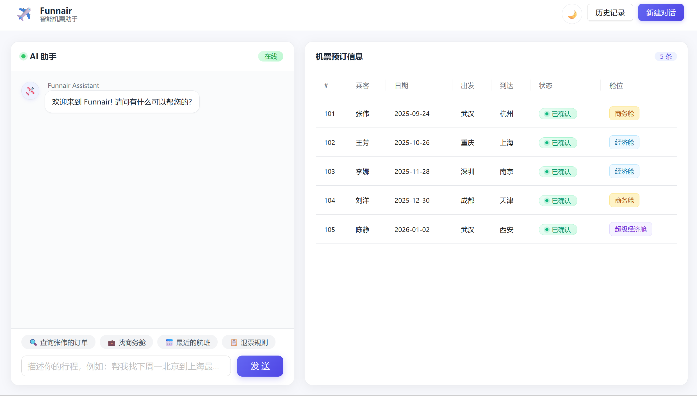
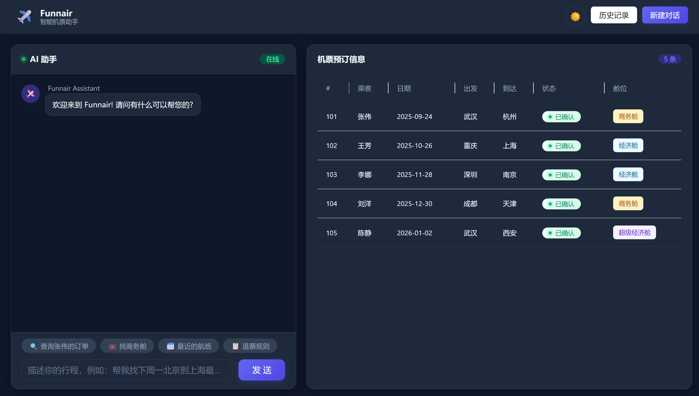

# ✈️ Funnair 智能机票助手

基于大语言模型的对话式机票预订系统，支持自然语言查询订单、AI 智能客服、暗色模式。



## 🎯 项目亮点

- **对话式交互**：自然语言查询机票订单，如"帮我查张伟的航班"
- **AI 流式回复**：基于 SSE 实现打字机效果，逐字输出
- **真·数据库**：MyBatis-Plus + MySQL 持久化订单数据
- **暗色模式**：CSS 变量 + `data-theme` 一键切换，localStorage 持久化
- **知识库问答**：RAG 检索增强，回答退票规则等问题
- **Markdown 渲染**：AI 回复支持 Markdown + 代码高亮
- **XSS 防护**：DOMPurify 过滤 AI 输出

## 🛠 技术栈

### 前端
- **框架**：Vue 3 + TypeScript + Vite
- **UI**：Ant Design Vue
- **Markdown**：vue3-markdown-it + highlight.js
- **安全**：DOMPurify
- **图标**：@iconify/vue

### 后端
- **框架**：Spring Boot 3.4
- **AI**：Spring AI + 通义千问（qwen-plus）
- **持久层**：MyBatis-Plus 3.5.7
- **数据库**：MySQL 8
- **流式响应**：SSE

## 📸 项目截图

### 浅色模式


### 暗色模式


## 🚀 快速开始

### 1. 数据库准备
```sql
CREATE DATABASE spring_tuipiao DEFAULT CHARSET utf8mb4;

USE spring_tuipiao;
CREATE TABLE booking (
    id              BIGINT       NOT NULL AUTO_INCREMENT,
    booking_number  VARCHAR(50)  NOT NULL,
    name            VARCHAR(50)  NOT NULL,
    `from`          VARCHAR(50)  NOT NULL,
    `to`            VARCHAR(50)  NOT NULL,
    `date`          DATE         NOT NULL,
    booking_to      DATE         DEFAULT NULL,
    booking_status  VARCHAR(20)  NOT NULL,
    booking_class   VARCHAR(30)  NOT NULL,
    PRIMARY KEY (id)
) ENGINE=InnoDB DEFAULT CHARSET=utf8mb4;

INSERT INTO booking (booking_number, name, `from`, `to`, `date`, booking_status, booking_class) VALUES
('101', '张伟', '武汉', '杭州', '2025-09-24', 'CONFIRMED', 'BUSINESS'),
('102', '王芳', '重庆', '上海', '2025-10-26', 'CONFIRMED', 'ECONOMY'),
('103', '李娜', '深圳', '南京', '2025-11-28', 'CONFIRMED', 'ECONOMY'),
('104', '刘洋', '成都', '天津', '2025-12-30', 'CONFIRMED', 'BUSINESS'),
('105', '陈静', '武汉', '西安', '2026-01-02', 'CONFIRMED', 'PREMIUM_ECONOMY');